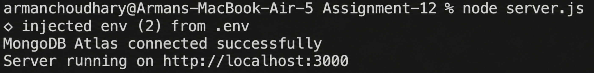
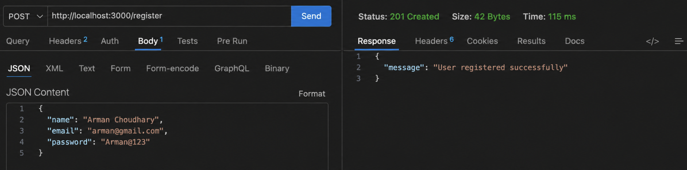
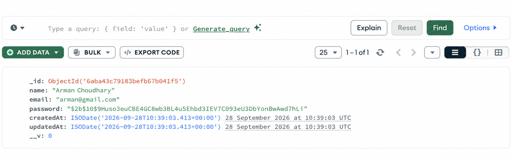
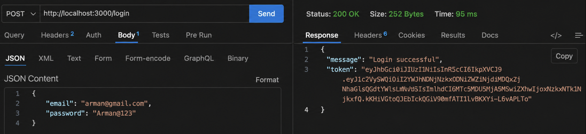
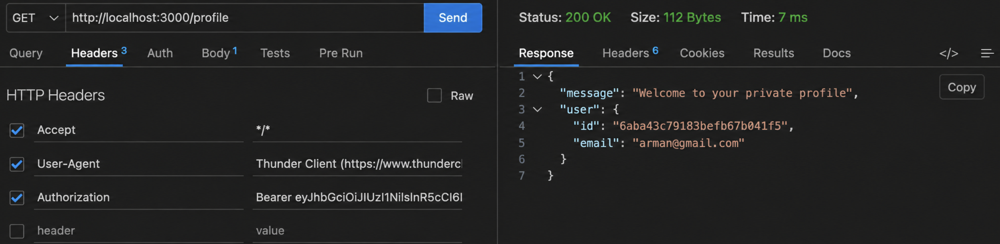
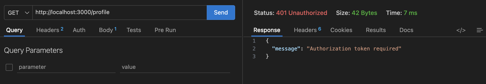

# Assignment 12 - Authentication API

**Developer:** Arman Choudhary  
A RESTful authentication API built with **Express.js**, **MongoDB**, **Mongoose**, **bcrypt**, **JSON Web Tokens (JWT)**, and **dotenv**.

---

## Objective

The objective of this assignment is to:
- Connect an Express.js backend application to **MongoDB Atlas** (or local MongoDB) using **Mongoose**.
- Create a reusable user model for storing name, email, and password information.
- Implement `POST /register` and `POST /login` authentication endpoints.
- Validate required fields before processing requests.
- Hash passwords securely using **bcrypt** before storing them in MongoDB.
- Prevent duplicate registrations by checking whether an email address already exists.
- Generate a JWT after successful login.
- Protect the `GET /profile` endpoint with JWT authentication middleware.
- Return appropriate HTTP status codes and structured JSON responses for successful requests and errors.
- Organize the project into separate `models/`, `controllers/`, `middleware/`, and `routes/` modules.
- Test and verify the API using **Thunder Client**, **Postman**, or **curl** and inspect stored users in MongoDB.

---

## Project Structure

```text
.
├── .env.example
├── .env
├── package.json
├── server.js
├── app.js
├── models/
│   └── User.js
├── middleware/
│   └── authMiddleware.js
├── controllers/
│   └── authController.js
├── routes/
│   └── auth.js
├── Screenshots/
│   ├── 1.png
│   ├── 2.png
│   ├── 3.png
│   ├── 4.png
│   ├── 5.png
│   └── 6.png
└── README.md
```

---

## Screenshots

### 1. MongoDB Connection and Server Startup
Server initialization confirming a successful MongoDB Atlas connection and server startup.



---

### 2. Successful User Registration
Thunder Client executing a `POST` request to `/register` with valid user data and returning `201 Created`.



---

### 3. User Document in MongoDB
MongoDB Atlas showing the registered user document with the password stored as a bcrypt hash.



---

### 4. Successful Login
Thunder Client executing a `POST` request to `/login` and receiving a JWT token.



---

### 5. Protected Profile Request
Thunder Client executing a `GET` request to `/profile` with a valid Bearer token and receiving the authenticated user's profile.



---

### 6. Authentication Error Handling
Thunder Client testing missing fields, duplicate registration, invalid credentials, and invalid or expired tokens.



---

## API Endpoints

### 1. Health Check
- **Method:** `GET`
- **URL:** `http://localhost:3000/`
- **Response (200 OK):**
```json
{
  "message": "Authentication API is running"
}
```

### 2. User Registration
- **Method:** `POST`
- **URL:** `http://localhost:3000/register`
- **Request Body (JSON):**
```json
{
  "name": "Arman Choudhary",
  "email": "arman@example.com",
  "password": "Password123!"
}
```
- **Response (201 Created):**
```json
{
  "message": "User registered successfully"
}
```

### 3. User Login
- **Method:** `POST`
- **URL:** `http://localhost:3000/login`
- **Request Body (JSON):**
```json
{
  "email": "arman@example.com",
  "password": "Password123!"
}
```
- **Response (200 OK):**
```json
{
  "message": "Login successful",
  "token": "eyJhbGciOiJIUzI1NiIsInR5cCI6IkpXVCJ9..."
}
```

### 4. Protected User Profile
- **Method:** `GET`
- **URL:** `http://localhost:3000/profile`
- **Headers:** `Authorization: Bearer <your_jwt_token>`
- **Response (200 OK):**
```json
{
  "message": "Welcome to your private profile",
  "user": {
    "id": "6745f...",
    "email": "arman@example.com"
  }
}
```

---

## Setup and Installation

### Prerequisites
- Node.js (v16 or newer recommended)
- MongoDB instance (MongoDB Atlas Connection URI or local MongoDB)

### Step 1: Install Dependencies
```bash
npm install
```

### Step 2: Configure Environment Variables
Copy `.env.example` to `.env` and fill in your connection strings:
```bash
cp .env.example .env
```
Example `.env`:
```env
MONGO_URI=mongodb+srv://<username>:<password>@cluster0.mongodb.net/assignment12?retryWrites=true&w=majority
JWT_SECRET=my_super_secret_jwt_key
PORT=3000
```

### Step 3: Start the Server
- Development Mode (with nodemon):
```bash
npm run dev
```
- Production Mode:
```bash
npm start
```
